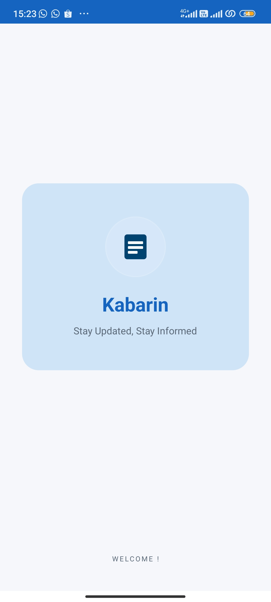
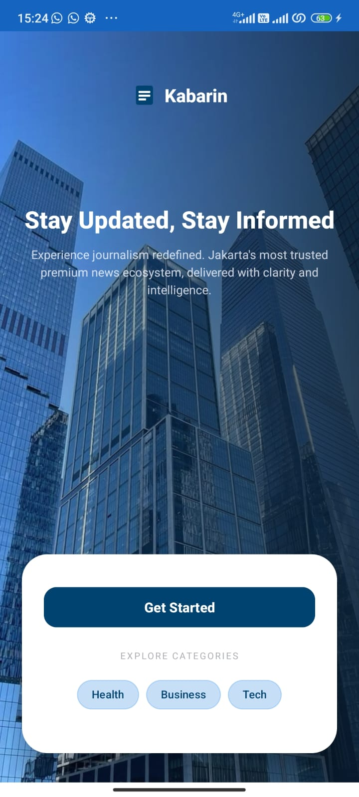
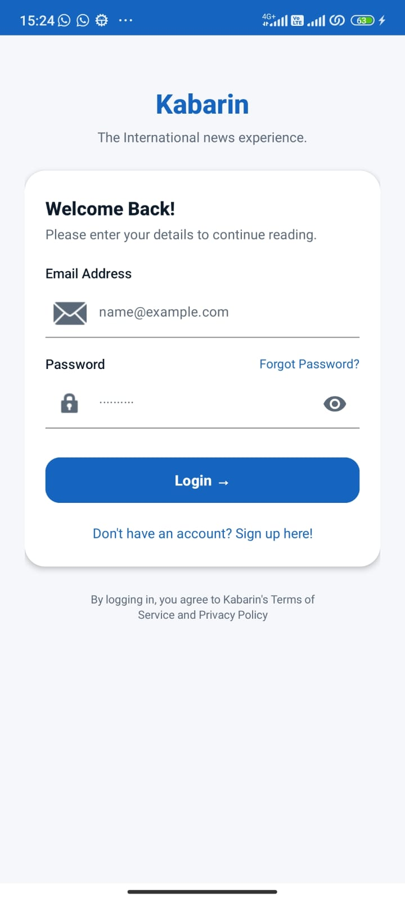
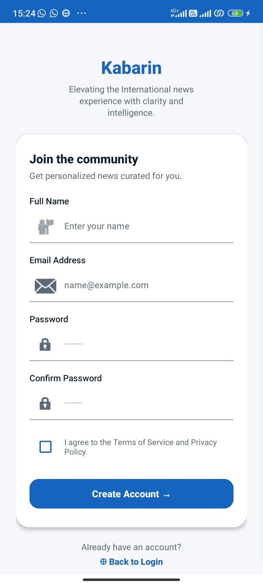
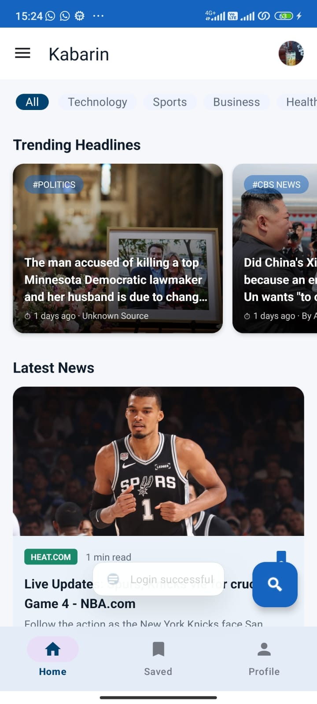
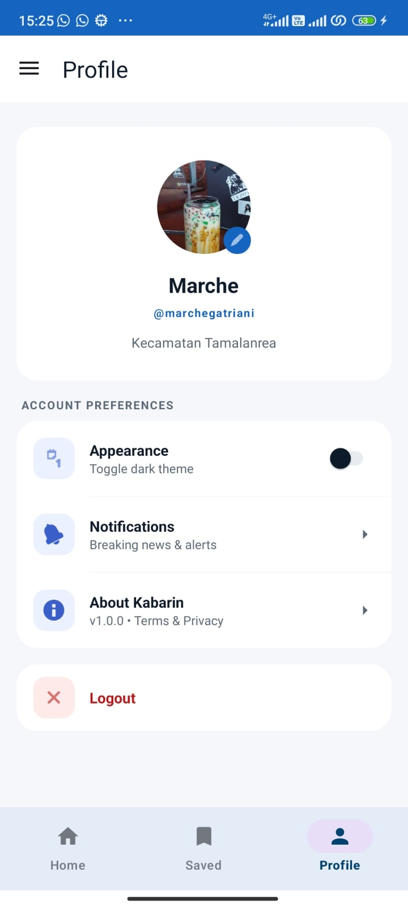
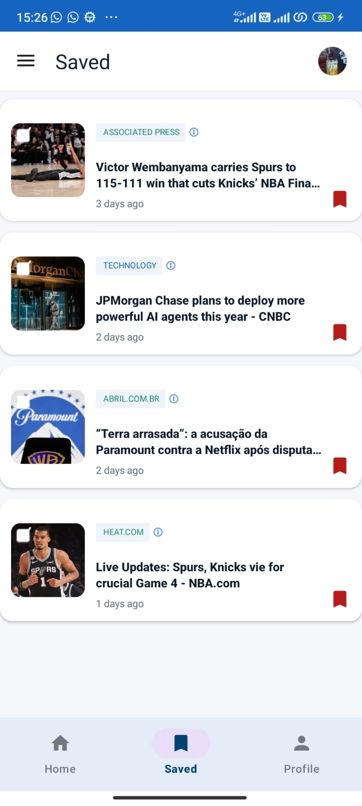

# Kabarin - News App 📰

**Kabarin** : aplikasi berita berbasis Android yang menyajikan informasi terkini dari berbagai negara dan kategori.

---

## ✨ Fitur Utama
- **Trending & Latest News:** Menampilkan berita utama dan terbaru menggunakan NewsAPI.
- **Search News:** Mencari berita berdasarkan kata kunci tertentu.
- **Saved News:** Menyimpan berita favorit ke dalam database lokal.
- **Offline Mode:** Tetap dapat melihat berita yang terakhir dimuat meskipun tanpa koneksi internet (Caching).
- **Dark/Light Theme:** Mendukung tema gelap dan terang yang menyesuaikan sistem atau preferensi pengguna.
- **User Profile:** Manajemen profil pengguna sederhana termasuk fitur edit profil.

---

## 🛠️ Spesifikasi Teknis

1. **Activity & Intent:** Implementasi activity (Splash, Login, Register, Main, Detail) dengan perpindahan data antar activity menggunakan Intent.
2. **RecyclerView:** Menampilkan daftar berita secara dinamis.
3. **Fragment & Navigation:** Menggunakan *Navigation Component* untuk mengelola navigasi antar fragment (Home, Search, Saved, Profile).
4. **Background Thread:** Menjalankan operasi database dan delay menggunakan `ExecutorService` dan `Handler`.
5. **Networking (Retrofit):** Mengambil data dari NewsAPI secara asinkron menggunakan library Retrofit.
6. **Local Data Persistence:** 
   - **SQLite:** Digunakan untuk menyimpan cache berita dan daftar berita favorit.
   - **SharedPreferences:** Digunakan untuk menyimpan sesi login dan preferensi tema.
7. **UI/UX:** Menggunakan Material Components dan mendukung sistem *Day/Night Mode*.

---

## 🚀 Tech Stack
- **Language:** Java
- **UI:** XML (Material Design 3)
- **Navigation:** Jetpack Navigation Component
- **Networking:** Retrofit 2 & GSON
- **Image Loading:** Glide
- **Database:** SQLite
- **Local Storage:** SharedPreferences

---

## 📸 Screenshots
| Halaman | Tampilan Layar | Halaman | Tampilan Layar | Halaman | Tampilan Layar |
| :--- | :---: | :--- | :---: | :--- | :---: |
| **Welcome** |  | **Started** |  | **Login** |  |
| **Register** |  | **Home** |  | **Profil** |  |
| **Saved** |  | &nbsp; | &nbsp; | &nbsp; | &nbsp; |

---

## ⚙️ Cara Menjalankan
1. Clone repositori ini.
2. Buka project menggunakan **Android Studio**.
3. Pastikan kamu memiliki **API Key** dari [newsapi.org](https://newsapi.org/).
4. Masukkan API Key tersebut ke dalam file `Constants.java`:

5. Build dan Run aplikasi di Emulator atau Perangkat Fisik.

---

## 👨‍💻 Author
**[Marche Gatriani Sude]**  
*Final Project - Lab Mobile Programming 2026*

